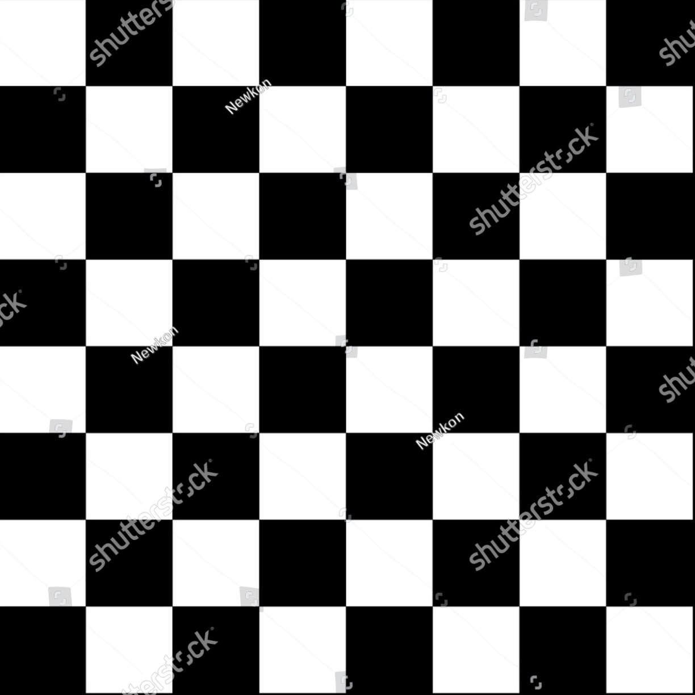

# Tareas del módulo

Las tareas de los módulos son pensadas para profundizar en los temas expuestos e interiorizar más el conocimiento.

## Tareas

En la generación de estilos hay infinitas maneras de llegar a un mismo resultado, así es que el punto de estas tareas es que pongas en práctica el conocimiento y refelexiones sobre el posicionamiento de los elementos, el flujo natural de html y pongas en practica el movimiento en los 3 ejes que te permite el css, adicional practiques las posibilidades vistas de poner una imagen

1. Crea tu propio taablero de ajedrez multicolor:
   
   - Debes crear un elemento cuadrado el cual contenga la imagen llamada tablero_ajedrez.jpg
   - Ahora en cada cuadro negro de la imagen, debes poner un cuadro de color verde.
   - En cada cuadro blanco de la imagen, debes poner un circulo amarillo
   - Al interior de cada elemento agrega una pequeña imagen que encuentres de una ficha de ajedrez sin importar cual, solo que debe estar una al interior de los cuadros verdes y otra al interior de los circulos amarillos.

