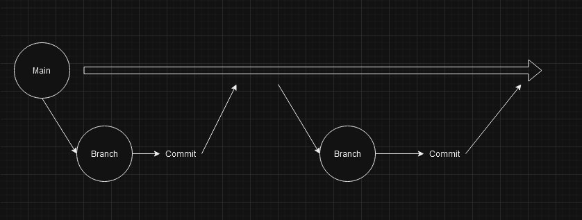

# Resumen clase 3

## Comandos GIT

### Introducción

Esto forma parte de la _introducción_ a **GIT**,
~~este texto no es valido~~

- git branch -m -> renombrar ramas
- ls -> ver los elementos que estan al interior de la carpeta donde estoy parado.
  - ls <nombre carpeta> -> ver los elementos dentro de la carpeta seleccionada.
  - ls -la -> listar elementos incluyendo permisos y archivos ocultos
- mkdir <nombre_carpeta> -> crea una carpeta en la ruta actual

## Comando de consola

1. cd -> mover entre ubicaciones
2. touch <nombre archivo> -> permite crear archivos vacios.
3. nano <nombre archivi> -> nos permite crear archivos y agregar contenido o editar archivos.
4. rm <nombre_archivo> -> sirve para eliminar archivos
   - rm -rf <nombre_archivo> -> sirve para eliminar carpetas y su contenido
5. clear -> limpiar el area de trabajo

## Branches

[Ver recomendaciones de maneno de ramas](ttps://medium.com/@jmz12/recomendaciones-para-el-manejo-de-ramas-5dd4b5a23c91)

### Tablas en markdown

| Nombre | Edad | Nacionalidad |
| ------ | ---- | ------------ |
| Julian | 32   | Colombiano   |
| Julian | 32   | Colombiano   |
| Julian | 32   | Colombiano   |
| Julian | 32   | Colombiano   |
| Julian | 32   | Colombiano   |
