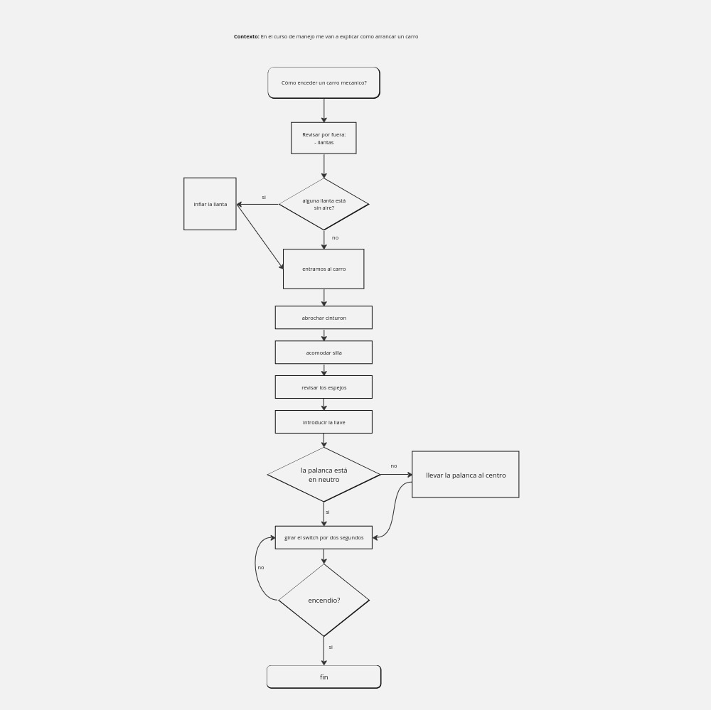

# Diagrama de flujo

### Definición de algoritmo

- Serie de pasos ordenados para resolver un problema.

### Simbolos mas comunes

### Ejercicio

### Numero factorial

- Recibir un numero entero
- Empezar a restar una unidad al numero recibido hasta llegar al 1
- Almacenar cada uno de los operadores para luego realizar la multiplicación
- Realizar la multiplicación de los operadores obtenidos
- Mostrar el resultado obtenido

[Visitar soluciones Factorial](https://www.geeksforgeeks.org/program-for-factorial-of-a-number/)
[Algoritmo organización datos](https://www.tutorialspoint.com/data_structures_algorithms/bubble_sort_algorithm.htm)

### Implementación del algoritmo para elemento mayor

[ver ejemplo de algrotimo elemento mayo](https://www.geeksforgeeks.org/javascript-program-to-find-the-largest-element-in-an-array/)
arr[10, 20, 4]

max = arr[0] -> 10

ciclo (i=1; arr.lenght; i++){
4 20
20 10
si (arr[i] > max) {
max = arr[i] -> 20
}
}

imprimir("El valor maximo es "+ maxx) -> El valor maximo es 20
