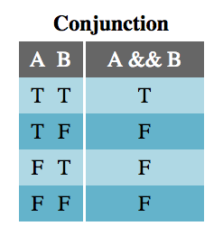
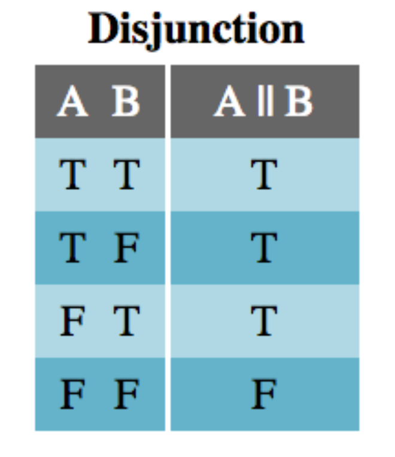
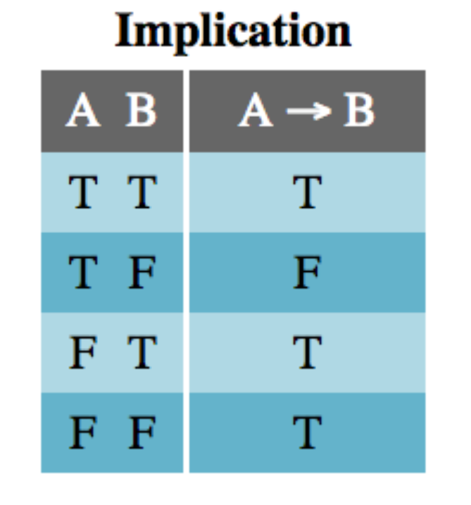
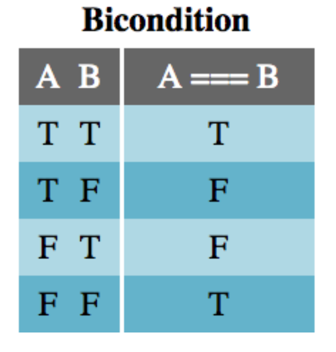
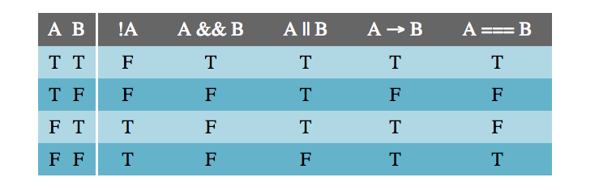
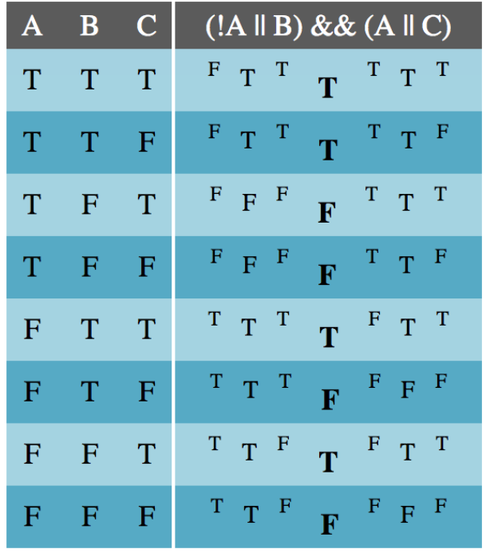

# Algoritmia

En este módulo vamos a dar cierre a todos estos conceptos base que estudiamos que de tantas herramientas nos han brindado para plantear `algoritmos` que den solución a nuestros problemas, ahora que se menciona este concepto de `algoritmos` nos damos cuenta de que nos hemos pasado por alto lo que dió pie a la necesidad del desarrollo de software, hemos pasado por alto todo este tiempo la importancia de entender nuestros problemas para poder luego pasar a darles solución. Miremos un concepto que hace referencia a la base del flujo de vida del desarrollo de software e interioricemos como todo lo que hemos aprendido nos ha dotado de herramientas para en este punto, ser maestros de los algoritmos.

## Qué es un Algoritmo?

Comunmente escuchamos la palabra algoritmo refiriendose a temas informaticos o de software, por ejemplo, todos hemos visto alguna pelicula en la que algún tipo de hacker se enfrenta a diferentes tipos de `algoritmos` de encriptado para poder acceder a archivos o sistemas con el fin de completar algún objetivo dentro de la pelicula, comunmente ayudar a los protagonistas a acceder a alguna base del villano.

Los algoritmos de encriptado son uno de los muchisimos usos del concepto, miremos concretamente a que se refiere este concepto y como lo vemos aplicado al desarrollo de software.

Un algoritmo en este caso `informatico` se refiere a un conjunto de instrucciones definidas, ordenadas y acotadas para resolver un determinado problema, realizar un calculo o desarrollar una tarea. En otras palabras, un alogoritmo es un conjunto de instrucciones paso a paso para conseguir un fin, es por esto que es un concepto tan abierto y lo vemos aplicado a tantas areas.

En el `desarrollo de software` el algoritmo corresponde a la fase previa al desarrollo, la idea es que siempre que vamos a desarrollar una solución mediante código, debemos saber que vamos a desarrollar, es decir, como vamos a programar una solución si no existe aún dicha solución? Entonces, es cuando cobra valor el concepto, es que el `algoritmo` es ese conjunto de pasos que debemos ejecutar para solucionar el problema. Pongamos un ejemplo.

Se nos plantea un problema, debemos leer cierta información de una base de datos y luego procesar el resultado para finalmente imprimirlo en pantalla.

Este es el problema, ahora automaticamente en base a todos los conceptos que hemos aprendido empezamos a pensar la solución, por supuesto lo primero sería pensar en como vamos a obtener la información de dicha base de datos, luego tendríamos que pensar en que tipo de procesado requieren los datos, las reglas definidas y como lo implementaremos para finalmente pensar en la manera como debemos imprimir en pantalla el resultado.

Cuando empezamos a pensar en como implementar las diferentes herramientas que conocemos para solucionar este problema lo que estamos planeando es el algoritmo que dará solución al problema, luego cuando pasamos a desarrollar estaríamos construyendo el software que implementa el algoritmo solución.

Para otro ejemplo no debemos irnos muy lejos, en modulos pasados vimos por ejemplo los `arboles binarios`, los cuales tienen unas reglas definidas para sus operaciones de inserción, eliminación y busqueda, entonces, si estamos desarrollando una implementación en Javascript de un arbol binario y estamos implementando la busqueda, necesitaremos verificar que se cumplan las reglas definidas por la estructura de datos en la busqueda de manera que funcione correctamente, esto es lo que se le llama `algoritmo de busqueda` pues son una serie de pasos con reglas definidas que debemos cumplir para que el funcionamiento sea correcto.

Sin embargo, los algoritmos no son utilizados solo en el mundo del desarrollo como se pensaría, sino que los utilizamos todo el tiempo, un manual de cocina o un set de instrucciones para armar un mueble en sí son algoritmos.

Los algoritmos tienen tres partes, `Input | Entrada`, `Process | Proceso` y `Output | Salida`, miremos cada una.

`Input | Entrada`

Es la información que le damos a nuestro algoritmo para su posterior procesado según requiera la solución a implementar.

`Process | Proceso`

Es el conjunto de pasos que a partir de los datos de entrada se realizan en el sistema de manera de realizar las operaciones necesarias para llegar al resultado esperado.

`Output | Salida`

Son los resultados de nuestro algoritmo luego de la transformación de la entrada y del sistema en base al proceso necesario para cumplir la tarea.

De este modo, un algoritmo parte de un estado inicial y de unos valores de entrada que luego siguen un número de pasos sucesivos para finalmente llegar al estado final que debe cumplir con la solución requerida.

### Caracteristicas de los Algoritmos

Los algoritmos en general, sin hacer énfasis en alguna clasificiación de los mismos tienen algunas carácteristicas en común, las cuales son:

- `Precisos`. Los algoritmos deben ser objetivos y planteados sin `ambiguedad` alguna
- `Ordenados`. Presentan una secuencia clara y precisa de los pasos a seguir, si acaso un paso presenta dependencia de otro se debe ser explicito.
- `Finitos`. Contienen un número definido de pasos y deben tener un fin medible.
- `Concretos`. Ofrecen una solución determinada para la situación o problema planteado

- `Definidos`. El mismo algoritmo debe dar el mismo resultado al utilizar unas mismas entradas, el comportamiento debe de ser estandar.

Así entonces, según su funcionamiento existen 5 tipos de algoritmos, miremoslos.

### Algoritmos de Busqueda

Los algoritmos de busqueda localizan uno o varios elementos en base a una serie de propiedades en una estructura de datos.

Según la estructura de datos existen dos tipos de algoritmos de busqueda:

- `Secuencial:` Se compara el elemento a buscar con cada elemento del conjunto de datos hasta encontrar el deseado o haber comparado con todos. Por ejemplo, la busqueda que se hace de si un elemento está presente en un arreglo.
- `Binaria:` En un conjunto de elementos ordenados, se divide repetidamente a la mitad la porcion de la lista que pueda contener el elemento buscado, siempre en intervalos mas pequeños hasta llegar a un punto sin continuidad o encontrar el elemento. Como por ejemplo, la busqueda que se hace en arboles binarios.

### Algoritmos de Ordenamiento

Los algoritmos de ordenamiento son algoritmos que reorganizan elementos de un listado según una regla que determina un orden, los mas habituales son los algoritmos de ordenamiento numérico y lexicográfico. Un orden eficiente facilita la tarea para algoritmos de busqueda o para la legibilidad de maquinas o personas mismas del set de datos. Algunos algoritmos conocidos de ordenamiento son `por burbuja`, `por selección` o `por ordenamiento rapido`.

### Programación Dinamica

La programación dinamica es un metodo de resolución de problemas en el que dividimos un problema complejo en subproblemas y calculamos y almacenamos las soluciones de manera que mas adelante para llegar a la solución del problema no se tengan que volver a calcular. La programación dinamica es un algoritmo pensado en la optimización de la recursividad. Por ejemplo, cuando utilizamos recursividad para dar solución a problemas de la serie fibonacci estamos utilizando programación dinamica.

### Algoritmos Voraces

Los algoritmos voraces son algoritmos los cuales funcionan por pasos y son de busqueda, estos en cada paso evaluan el estado del sistema y operan según este, sin tener en cuenta sus decisiones pasadas para buscar la solución mas optima, son utilizados comunmente para problemas de optimización por ejemplo con `grafos ordenados`. Algunos de los mas conocidos algoritmos voraces son:

- `Problema de la mochila fraccional (KP)`. Disponemos de una colección de objetos (cada uno de ellos con un valor y un peso asociados) y debemos determinar cuáles colocar en la mochila para lograr transportar el valor máximo sin superar el peso que puede soportar.
- `Algoritmo de Dijkstra`. Utilizado para determinar el camino más corto desde un vértice origen hasta los demás vértices de un grafo, que tiene pesos en cada arista.
- `Codificación Huffman`. Método de compresión de datos sin perder información, que analiza la frecuencia de aparición de caracteres de un mensaje y les asigna un código de longitud variable. Cuanto mayor sea la frecuencia le corresponderá un código más corto.

### Algoritmos Probabilísticos

Es una técnica la cual utilizando la aleatoriedad en la entrada llega a una solución que bien puede no ser la optima pero cumple con las condiciones dadas.

Se utiliza en situaciones con limitaciones de tiempo o memoria y cuando se puede aceptar una buena solución de media, ya que a partir de los mismos datos se pueden obtener soluciones diferentes y algunas erróneas. Para que sea más probable ofrecer una solución correcta, se repite el algoritmo varias veces con diferentes submuestras aleatorias y se comparan los resultados.

Los dos tipos de algoritmos probabilisticos son los siguientes:

- `Algoritmo de Montecarlo.` Dependiendo de la entrada, hay una pequeña probabilidad de que no acierte o no llegue a una solución. Se puede reducir la probabilidad de error aumentando el tiempo de cálculo.
- `Algoritmo de Las Vegas.` Se ejecuta en un periodo de tiempo concreto. Si encuentra una solución en ese tiempo ésta será correcta, pero es posible que el tiempo se agote y no encuentre ninguna solución.

## Operadores Aritmeticos

Los operadores aritmeticos como su nombre lo indica son operadores que nos ayudan a hacer todo tipo de operaciones aritmeticas con valores numericos o strings haciendo uso del concepto de `coerción`.

Estos operadores son enfocados principalmente en su uso con variables de tipo númerico, por supuesto también se pueden utilizar en otros tipos de datos haciendo uso de la coerción pero no es la idea pues el comportamiento puede ser extraño o poco predecible.

Estos operadores son los siguientes.

- `+` `Suma`, el operador suma ambos lados de la expresión (También es utilizado en cadenas de texto para concatenar)
- `-` `Resta`, resta ambos lados de la expresión
- `*` `Multiplicación`, multiplica ambos lados de la expresión
- `/` `División`, divide ambos lados de la expresión, siendo el numerador el lado izquierdo
- `%` `Modulo`, divide ambos lados de la expresión y retorna el residuo de la operación

Miremos ahora algunos ejemplos de como los utilizamos para operar entre dos o mas valores númericos

```
console.log(4 + 5) // 9
console.log(10 - 5) // 5
console.log(4 * 5) // 20
console.log(10 / 5) // 2
console.log(10 % 2) // 0
console.log((10 + 1) - (2 * 3)) // 5. Una mas compuesta, para agrupar usamos parentesis
console.log('Hola' + ' Mundo') // Hola Mundo
```

> Para operaciones mas complejas existe un módulo que implementa Javascript llamado Math, el cual cuenta con gran cantidad de funciones pre definidas para operaciones como raiz cuadrada, aproximación, potenciación y otras mas super complejas, lee mas [**aquí**](https://developer.mozilla.org/es/docs/Web/JavaScript/Guide/Expressions_and_Operators)

Hay otros operadores de tipo de asignación que nos permiten utilizar atajos a utilización de operadores aritmeticos, miremoslos.

- `++ Incremento.` Aumenta en 1 la variable dada, si `x` es 4 entonces `x++` es 5
- `-- Decremento.` Disminute en 1 la variable dada, si `x` es 4 entonces `x--` es 3
- `- Negación Unitaria.` Convierte el valor dado en su signo contrario, si `x` es 4 entonces `-x` es -4
- `+ Conversión Positiva.` Intenta convertir el valor dado en un número, si no lo es ya, si `x` es `'3'` entonces `+x` nos retorna `3`, para valores booleanos `+true` es `1` y `+false` es `0`
- `** Operador de exponenciación.` Calcula la base al exponente, por ejemplo `2 ** 3` retorna `8`

## Operadores Lógicos

## Valores Truthy y Falsy

Es uno de los elementos principales de Javascript y de cualquier lenguaje de programación y es de donde nos apoyamos para el control de flujo, este concepto hace referencia a cuando una expresión es verdadera y cuando falsa, Javascript hace la conversión de expresiones a valores Boolean los cuales si utiliza propiamente para evaluar flujos.

Estas expresiones las debemos construir haciendo uso de los operadores lógicos, de comparación y de igualdad dados por el lenguaje. Miremos inicialmente cuales son los operadores que tenemos a nuestra disposición en Javascritp

### Igualdad

- `==` Igualdad regular, es el operador que valida que ambos lados de la expresion tengan el mismo valor y hace conversiones necesarias para verificar igualdad
- `===` Igualdad estricta, es el operador que valida que ambos lados de la expresión sean iguales y no hace transformaciones por tanto verifica también el tipo del dato

> No se deben confundir los operadores de igualdad con el de asignación `=` el cual es el operador que utilizamos para asignar valores a variables, este no es utilizado para expresiones booleanas

### Comparación

- `>` Comparador de mayor, valida que la parte izquierda de la expresión represente un valor superior al de la derecha
- `<` Comparador de menor, valida que la parte izquierda de la expresión represente un valor inferior al de la derecha
- `>=` Comparador de mayor o igual, valida que la parte de la izquierda represente un valor mayor o igual al de la derecha
- `<=` Comparador de menor o igual, valida que la parte de la izquierda represente un valor menor o igual al de la derecha

### Lógicos

- `||` Or, operador `o` verifica que al menos uno de los lados de la expresión se cumpla
- `&&` And, es el operador `y` verifica que ambos lados de la expresión se cumplan
- `!` No, es el operador `no` es la negación de la expresión, retorna true si el negado de la expresión es verdadero

```
console.log(true && false) // false
console.log(true || false) // true
console.log(!true) // false
console.log(!false) // true
console.log(true && false) // false
console.log(10 == '10') // true
console.log(10 === '10') // false
console.log(10 > 9) // true
console.log(10 <= 9) // false
```

Siguiendo el código anterior tenemos un ejemplo de la utilización de cada operador, junto con su descripción podemos guiarnos sobre cómo construir validaciones más complejas, al igual que con las operaciones aritmeticas podemos agrupar para construir expresiones booleanas que dependen de varias condiciones, miremos un ejemplo ya con un concepto que miraremos a continuación que son los condicionales, su funcionamiento es intuitivo, para esto veamos la evolución de una validación y como se puede crear una compuesta y su comportamientos:

```
const first_validation = true;
const second_validation = false;
if(first_validation == true || second_validation == false){
    console.log('Se cumple la condición');
}else{
    console.log('No se cumple la condición')
}
```

En el casos anterior, para que se ejecute el bloque al interior del `if` se debe cumplir que `first_validation` sea true y/o `second_validation` sea false, en caso de que ambas constantes tomen un valor opuesto al antes descrito de manera simultane, se ejecutara el boque de codigo `else`. Ahora evaluemos un comportamiento mas restrictivo:

```
const first_validation = true;
const second_validation = false;
if(first_validation == true && !second_validation){
    console.log('Se cumple la condición');
}else{
    console.log('No se cumple la condición')
}
```

Ahora vemos un comportamiento mas restrictivo del condicional frente a las constantes evaluadas, ahora la unica forma de que se ejecute el el bloque `if` es que `first_validation` sea true y que `second_validation` sea false con cualquier otra combinación se ejecutaria el bloque `else`. Finalmente juntemos las condiciones anteriores en una y analicemos que sucede:

```

const first_validation = true;
const second_validation = false;
if((first_validation == true || second_validation == false) && (first_validation == true && !second_validation) ){
console.log('Se cumple la condición');
}else{
console.log('No se cumple la condición')
}

```

En el ejemplo anterior juntamos las dos condiciones antes analizadas ahora bien, ¿Que debería suceder?, en este caso las estamos agrupando con el operador `&&`, lo que implica que ambas condiciones se deben cumplir para que se ejecute el bloque de código `if` en caso contrario se ejecuta el bloque `else`.

Así visualizamos como podemos apoyarnos de parentesis para construir situaciones mas complejas, por supuesto como lo vimos en módulos anteriores nuestras variables pueden contener valores booleanos y podemos apoyarnos de estas para contruir operaciones de verdadero o falso, así mismo, es importante mencionar que las variables cuyo valor apunte a null el programa las tomara como falso en las evaluaciones booleanas, miremoslo con un ejemplo.

```

const results = searchInformation('IDCliente123')
if(results) {
console.log(results)
}else{
console.log('No hay resultados para el client con el ID ingresado')
}

```

Por temas del ejemplo digamos que `searchInformation` es una función que busca data para un cliente ingresado como parametro en alguna base de datos, si no encuentra información no devuelve nada, es decir, es null por lo que podemos guiarnos de evaluar si resultados existe para saber si hubo o no resultados, es una forma bastante util de verificar si una variable le está apuntando a algún valor o es null.

Así entonces ya tenemos una idea de como construir expresiones lógicas que nos ayudarán a controlar el flujo de nuestros códigos, ahora miremos como las usamos para controlar flujos.

## Tablas de Verdad

Las tablas de verdad, para cada operador, nos dicen cual es el resultado de una operación según los valores de entrada. Entender las tablas de verdad es muy importante puesto que si dos operaciones con la misma entrada retornan los mismos valores, esto quiere decir que las expresiones son equivalentes, es decir, pueden reemplazarse una con otra, por tanto, este concepto nos brinda herramientas para solucionar problemas de distintas maneras.

Miremos entonces las tablas de verdad.

### `Conjunción`

Para el caso de la tabla de verdad de conjunción, se refiere al resultado de la operación `y` entre dos entradas A y B que en Javascript la denotamos con el operador `&&`, la columna de la derecha es el resultado de la operación según los valores de entrada `T` corresponde a `true` y `F` a `false`.



### `Disjunción`

Para este caso corresponde a la operación `o` la cual en Javascript la denotamos con el operador `||`



### `Implicación`

La implicación implica que si `A` entonces `B`, entonces, si `A` es verdadero entonces `B` también, lo será, sin embargo, `B` puede ser verdadero por otras razones, lo que genera que las ultimas dos lineas de la tabla sean verdaderas como lo ilustra la imagen. Esta no cuenta con un operador lógico, mas sin embargo hace parte de la lógica booleana basica.



### `Bicondición`

La bicondición tampoco cuenta con un operador en Javascript mas sin embargo es otra operación fundamental, la bicondición representa el si y solo si, por tanto, solo es verdadero cuando las dos entradas comparten el mismo valor.



### `Tabla de verdad completa`

En la siguiente imagen vemos la tabla de verdad booleana basica completa, la cual nos ilustra todos los posibles flujos utilizando las operaciones basicas de verdad.



### `Calculando tablas compuestas`

Como lo realizamos con operaciones matematicas agrupadas podemos hacerlo también con operaciones booleanas, miremos el siguiente ejemplo donde se tiene un set de operaciones mas avanzado y compuesto y se requiere de elaborar una tabla de verdad que ilustre los distintos resultados de la validación en base a los valores de entrada.



Como notamos en el ejemplo anterior, lo que hacemos es realiza las operaciones de los parentesis primero y luego operar según se requiera entre ellas, de esta manera podemos construir cualquier tabla de verdad, por supuesto dependiendo de la cantidad de entradas y operaciones será mas complejo, pero si descomponemos las operaciones en mas pequeñas podemos llegar al resultado.

## Final del módulo

Con este módulo damos clausura a los conceptos fundamentales y bases de Javascript, vamos a cerrar viendo un tema importante también no tanto de código como tal sino fundamental para el flujo de desarrollo de software en general que es los diagramas de flujo para luego con todos los conocimientos bases que tenemos avanzar con Frontend que es la primera parte de implementación pura de Javascript al mundo real.

```

```
