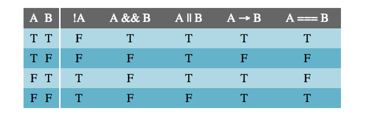
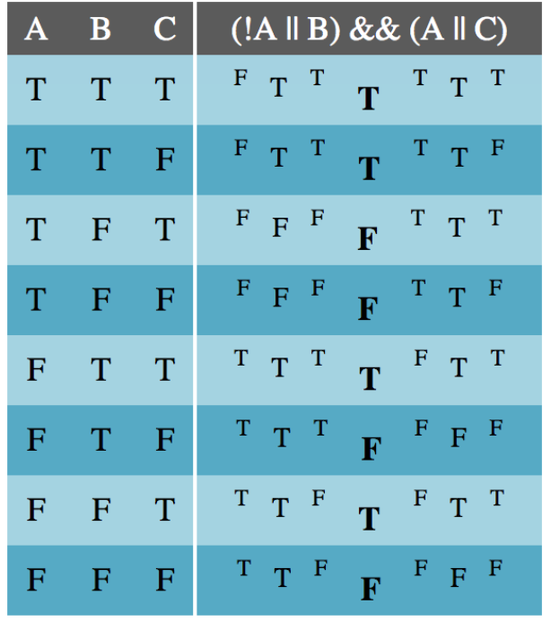

# Algoritmo informatico

### Partes

- Input | Entrada
- Process | Proceso
- Output | Salida

### Caracteristicas de un algoritmo

- Precisos: Deben ser objetivos
- Ordenados: Secuencia clara
- Finitos: Debe tener fin
- Concretos: Debe tener una solución clara
- Definidos: para un mismo input debo tener siempre un mismo output

### Operadores Aritmeticos

- suma +
- resta -
- Multiplicación \*
- División /
- Modulo %

- Incremento ++
- Decremento --
- Negacion unitaria -#
- Conversión Positiva +#
- Operador de exponenciación \*\*

### Operadores lógicos

- Diferencia
  - !== (1 !== 0 true) - (1 !== 1 false)
- Igualdad
  - == (1 == "1") Regular
  - === (1 === 1) Estricto
- Comparación
  - <
  - >
  - <=
  - > =
- Lógicos

  - || or
  - && and
  - ! No

  

  
